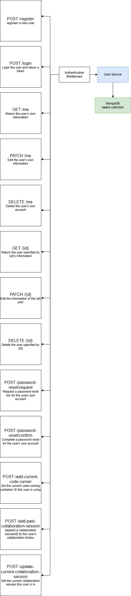

# User Service

This module contains code for the `User` micro-service, which serves to retrive questions from the `users_collection`



## 1. Pre-requiesites

- `node 22.19.0 (LTS)`

- `pnpm 10.17.1`

## 2. Installation

- **Note:** This micro-service requires the root repository dependencies + MongoDB to be running to function properly

```
pnpm install
```

## 3. Run in Dev Mode

```
pnpm run dev
```

## 4. Run in Production Mode

```
pnpm run start
```

## 5. Testing

```
pnpm run test
```

## 6. API Docs

- Refer to [api_docs.md](api_docs.md)